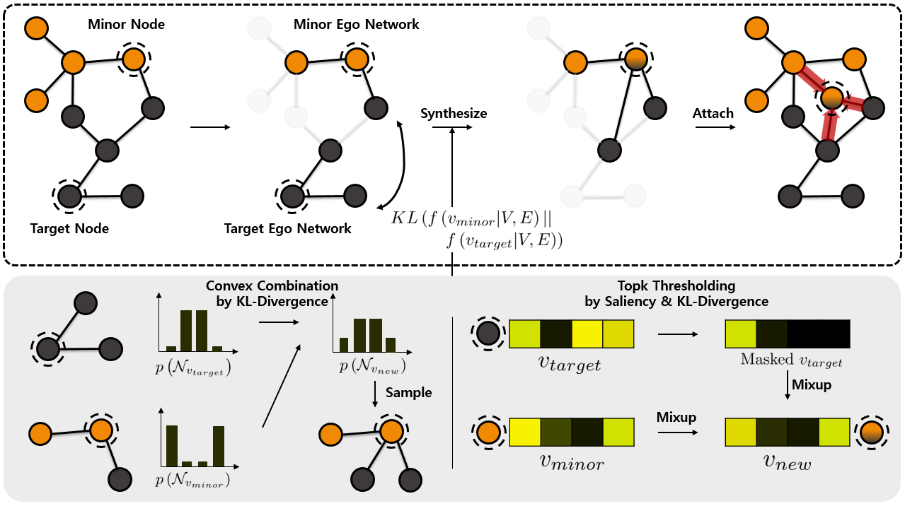

# GraphENS: Neighbor-Aware Ego Network Synthesis for Class-Imbalanced Node Classification

## Introduction

Code for ICLR 2022 paper "[GraphENS: Neighbor-Aware Ego Network Synthesis for Class-Imbalanced Node Classification](https://openreview.net/forum?id=MXEl7i-iru)"


This work investigates node & neighbor memorization problem in class-imbalanced node classification.
To mitigate the memorization problem, we propose GraphENS, which synthesizes ego networks to construct a balanced graph by mixing node features and neighbor distributions of two nodes.

## Semi-Supervised Node Classification (Public Split)

The code for semi-supervised node classification. 
This is implemented mainly based on [Pytorch Geometric](https://github.com/rusty1s/pytorch_geometric).

- Running command: 'python main_semi.py --ens'
  1. Experiment Dataset (the dataset will be downloaded automatically at the first running time):\
       set dataset = ['Cora', 'Citeseer', 'PubMed']
  2. Backbone GNN':\
       set net = ['GCN', 'GAT', 'SAGE']

We will update LT and Natural versions.

## Dependencies
- Python >= 3.6
- Pytorch >= 1.7
- Pytorch Geometric >= 1.6

## Citation
```
@inproceedings{
    park2022graphens,
    title={Graph{ENS}: Neighbor-Aware Ego Network Synthesis for Class-Imbalanced Node Classification},
    author={Joonhyung Park and Jaeyun Song and Eunho Yang},
    booktitle={International Conference on Learning Representations},
    year={2022},
    url={https://openreview.net/forum?id=MXEl7i-iru}
}
```
