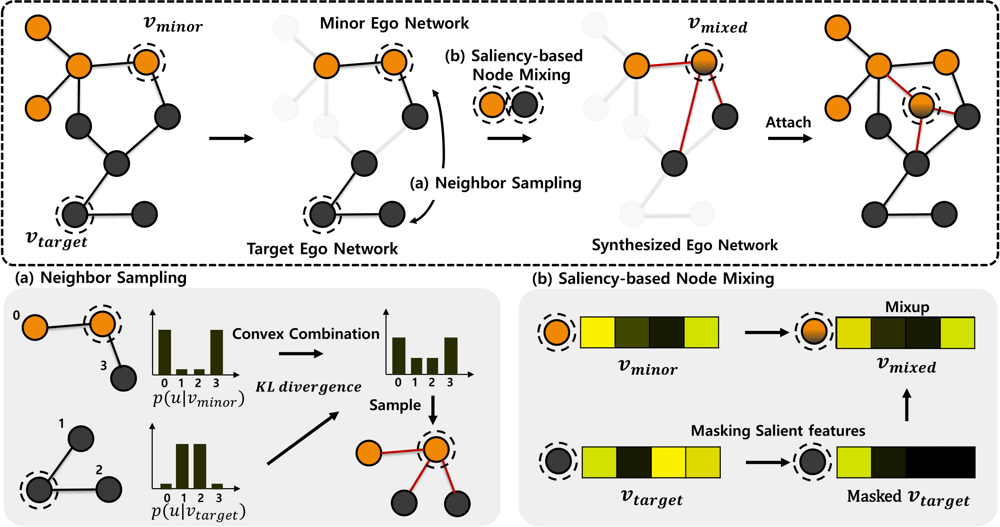

# GraphENS: Neighbor-Aware Ego Network Synthesis for Class-Imbalanced Node Classification
[](https://doi.org/10.5281/zenodo.10040243)
## Introduction

Official Pytorch implementation of ICLR 2022 paper "[GraphENS: Neighbor-Aware Ego Network Synthesis for Class-Imbalanced Node Classification](https://openreview.net/forum?id=MXEl7i-iru)"


This work investigates node & neighbor memorization problem in class-imbalanced node classification.
To mitigate the memorization problem, we propose GraphENS, which synthesizes ego networks to construct a balanced graph by mixing node features and neighbor distributions of two nodes.

## Semi-Supervised Node Classification (Public Split)

The code for semi-supervised node classification. 
This is implemented mainly based on [Pytorch Geometric](https://github.com/rusty1s/pytorch_geometric).

- Running command:
  ```
  python main_semi.py --ens \
  --dataset [dataset] \
  --net [net] \
  --n_layer [n_layer] \
  --feat_dim [feat_dim] \
  --keep_prob [keep_prob] \
  --pred_temp [pred_temp]
  ```
  1. Experiment Dataset (the dataset will be downloaded automatically at the first running time):\
       Set [dataset] as one of ['Cora', 'Citeseer', 'PubMed']
  2. Backbone GNN architecture:\
       Set [net] as one of ['GCN', 'GAT', 'SAGE']
  3. The number of layer for GNN:\
       Set [n_layer] as one of [1, 2, 3]
  5. Hidden dimension for GNN:\
       Set [feat_dim] as one of [64, 128, 256]
  7. Feature masking hyperparameter ***k***:\
       Set [keep_prob] as one of [0.01, 0.05]
  6. Temperature 𝞽:\
       Set [pred_temp] as one of [1, 2]

## Node Classification on Long-Tailed(LT) Citation Networks

The code for long-tailed datasets. 
Nodes are removed until the class distribution follows a long-tailed distribution with
keeping the connection in graphs at most. 


- Running command:
  ```
  python main_lt.py --ens \
  --imb_ratio 100 \
  --dataset [dataset] \
  --net [net] \
  --n_layer [n_layer] \
  --feat_dim [feat_dim] \
  --keep_prob [keep_prob] \
  --pred_temp [pred_temp]
  ```
  1. Experiment Dataset (the dataset will be downloaded automatically at the first running time):\
       Set [dataset] as one of ['Cora', 'Citeseer', 'PubMed']
  2. Backbone GNN architecture:\
       Set [net] as one of ['GCN', 'GAT', 'SAGE']
  3. The number of layer for GNN:\
       Set [n_layer] as one of [1, 2, 3]
  5. Hidden dimension for GNN:\
       Set [feat_dim] as one of [64, 128, 256]
  7. Feature masking hyperparameter ***k***:\
       Set [keep_prob] as one of [0.01, 0.05]
  6. Temperature 𝞽:\
       Set [pred_temp] as one of [1, 2]
We will update LT datasets and co-purchasing network datasets.

## Dependencies
This code has been tested with 
- Python == 3.6.10
- Pytorch == 1.7.0
- Pytorch Geometric == 1.6.2
- torch_scatter == 2.0.5

## Citation
```
@inproceedings{
    park2022graphens,
    title={Graph{ENS}: Neighbor-Aware Ego Network Synthesis for Class-Imbalanced Node Classification},
    author={Joonhyung Park and Jaeyun Song and Eunho Yang},
    booktitle={International Conference on Learning Representations},
    year={2022},
    url={https://openreview.net/forum?id=MXEl7i-iru}
}
```
